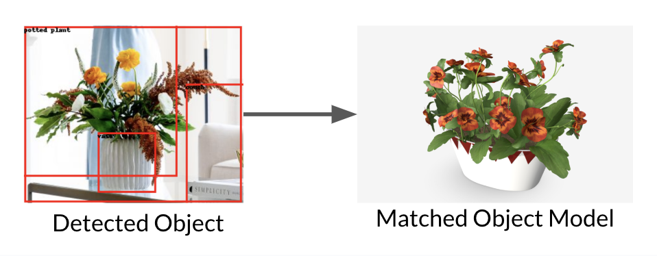

# Interactive-Scene-Reconstruction
In this proposal, we blueprint a design for a simulation framework that creates interactable physics-based objects from 2D RGB images of a given scene that can be further analyzed and studied by humans.

# Setup # 

1. Download Pandas3D (SDK Install) - https://www.panda3d.org/download/
2. Clone this repo 
2. Install required dependancies 
3. Run the main.py file

To reconstruct scene from different image change the IMG_TO_ANALYZE to be the file you want to try to reconstruct. 

# Selecting 3D represnetation 

1. After the model analyzes the 2D photo, it will ask you to pick the best 3D model for each object. 
2. You can press Select if you are satisfied with the 3D model, oterwise press continue to cycle through all available objects until you find one. 

Disclaimer: 
            None of these 3D assets were created by us, they are developed by creators on the SketchFab website. 
            When the image is being downloaded sometimes the download textures aren't properly added or the model cannot be downloaded at all.

# Credit # 

1. For downloading 3D models from SketchFab - https://github.com/laurirasanen/sketchfab_dl
2. For depth estimation - https://medium.com/artificialis/getting-started-with-depth-estimation-using-midas-and-python-d0119bfe1159#:~:text=MiDaS(Multiple%20Depth%20Estimation%20Accuracy,depth%20estimation%20from%20single%20images.

